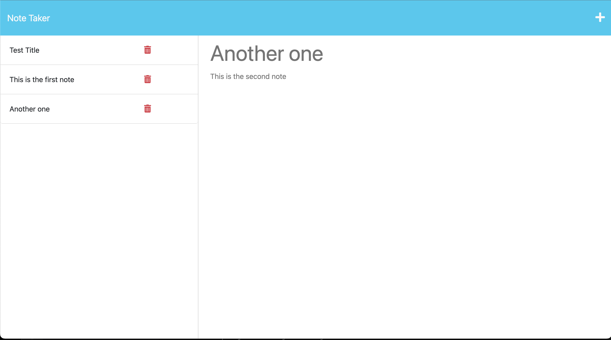

# Taking Notes

## Table of Contents

- [Description](#description)
- [Installation](#installation)
- [Usage](#usage)
- [Video](#video)
- [Screenshot](#screenshot) 
- [Contributing](#contributing)
- [Tests](#tests)
- [Questions](#questions)

## Description

- AS A small business owner
- I WANT to be able to write and save notes
- SO THAT I can organize my thoughts and keep track of tasks I need to complete

## Installation

This project makes use of UUIDV4 and Node.js. Both will need to be installed on your system.
Once Node is downloaded onto your computer, install UUID by running "npm install uuid" in the terminal.

## Usage

- GIVEN a note-taking application
- WHEN I open the Note Taker
- THEN I am presented with a landing page with a link to a notes page
- WHEN I click on the link to the notes page
- THEN I am presented with a page with existing notes listed in the left-hand column, plus empty fields to enter a new note title and the note’s text in the right-hand column
- WHEN I enter a new note title and the note’s text
- THEN a Save icon appears in the navigation at the top of the page
- WHEN I click on the Save icon
- THEN the new note I have entered is saved and appears in the left-hand column with the other existing notes
- WHEN I click on an existing note in the list in the left-hand column
- THEN that note appears in the right-hand column
- WHEN I click on the Write icon in the navigation at the top of the page
- THEN I am presented with empty fields to enter a new note title and the note’s text in the right-hand column

[Deployment](https://sleepy-crag-95402.herokuapp.com/notes)

## Video

[Recording](https://drive.google.com/file/d/1rG_Q_eowkTNgmsbojHm9HfGEd2n5nlQf/preview)

## Screenshot

## License

This project is licensed under the MIT License. 

For more information, please visit [https://opensource.org/licenses/MIT](https://opensource.org/licenses/MIT).

## Contributing

Please contact via email for any suggestions for improvements. 

## Tests

n/a

## Questions

If you have any questions or need additional information, feel free to contact me:

- GitHub: [winstonheard](https://github.com/winstonheard)
- Email: winston.nolen@gmail.com